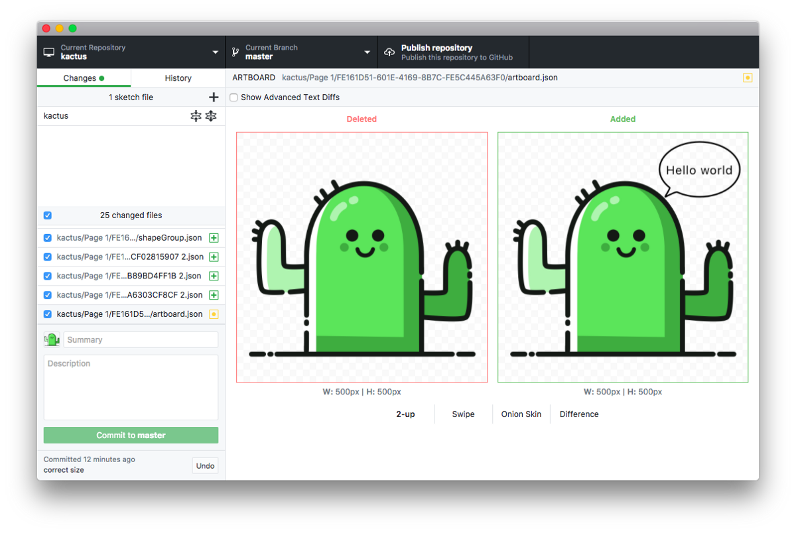
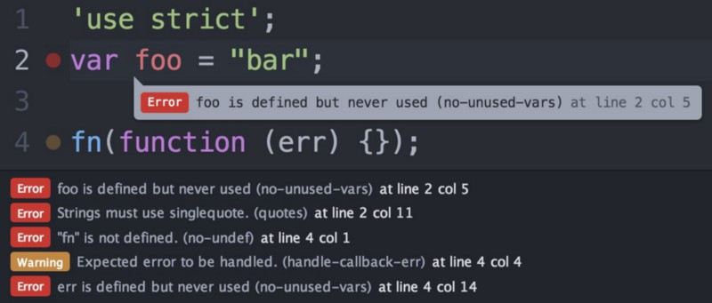

_Design Engineers_. It might sound antinomic but I’ve come to realise that it is far from it. I’ve been thinking for a while about the design profession as a whole and how it might change in the future. I’m going to tell you how that reflection led me to work on Sketch, create Kactus as well a bunch of other tools, and to the concept that I call _Design Engineers_.

And it is not going to be about designers learning to code or code-based design tools, that’s an entirely different story - which is interesting but irrelevant for this topic.

### Background

To understand that reasoning, you will need some background to know where it started from. I studied what we call “general engineering” in France which includes everything from mechanics to electronics to automatics but funnily enough, not much software. I only learned to code on the side by myself.

So when I first got a job as a developer, it was my first exposure to both the software engineering workflow and the design workflow. And I was amazed by the friction of the later.

I realised that I really like watching how people work and try to improve/optimize their workflow. So I ended up joining Sketch to improve the workflow of designers as I believe there are tremendous opportunities in that space.

### Hypothesis

In the last couple of decades, “people who code” went from “developers” to “software engineers”, and **in the next couple of decades, “designers” will become “design engineers”** in a similar fashion.

There is a lot to learn from the way developers changed how they work, what tools enabled that transformation, what process emerged, etc..

We will go through 3 examples of how developer tools already influenced some design tools and processes.

Before diving in, I want to address the comment I get every time I talk about this topic:

> _Designers and developers are completely different, we (designers) are creative people while developers are more analytical, and so are engineers._

> _— Designers_

I don’t believe that is true. First of all, writing code is also a creative process: code can be beautiful or ugly, and there isn’t a single “right” way to do things.

What makes engineers is everything outside the writing code part. It’s how they collaborate with each other, how they reliably deploy code, the tools that they have to make sure that the code they write does the right thing, independently how they wrote it.

> _To create the future, we must understand the past_

> _— Tim Kastelle_

What I find interesting when looking at both developers and designers is how little the job of designers changed compared to the developers’ one. Sure, the design tool designers are using probably changed, but the process is still the same, what they are doing is still the same (starting to change tho!). However, on the other side, all the practices and collaboration tools that literally every software engineers use now were created in the last couple of decades.

### The Joel Test

A good example of how that evolution is the Joel Test. In 2000, Joel Spolsky, founder of Stack Overflow and Trello and probably one of the most famous software engineers out there, wrote a now-famous [blog post](https://www.joelonsoftware.com/2000/08/09/the-joel-test-12-steps-to-better-code/) about a simple test to determine if a development team had a sane engineering culture and processes.

It consists of 12 quick questions that you answer by yes or no. Super simple. It gives a score from 0 to 12, 12 being the best.

In 2000, most companies were scoring a 2 or 3, with only the best teams scoring 12.

Today, around half of the questions are outdated thanks to the progression of developer tools and infrastructures and I wouldn’t be surprised if most companies are now scoring above 10.

The interesting thing about the test is that pretty much all of those questions can be directly translated to the design field, and they are all more relevant than ever.

### 1\. Version Control

The first question of the test is the perfect example of those two properties (outdated for the developers, relevant for the designers):

> _Do you use source control?_

In 2000, when the question was written, git wasn’t there yet and using source control was pretty rare. Today it’s just unthinkable to start a project without it.

However, for a design project, it’s still really rare. Usually, people come up with “creative” naming conventions or directory structures.

And let’s be clear, by version control, I’m not talking about Dropbox or Google Drive. That is not version control.

Why? For example, Sketch has this nice little feature called “autosave”. And scrolling around or selecting an artboard is considered a change to the Sketch file so that when you reopen the file, it goes back to the same state you left it. It means that when multiple people use the file at the same time, you end up with multiple conflicting copies of the same file even if they are just scrolling around.

This is only one of the many issues that you can face with Dropbox, and they all boiled down to the same root cause: lack of control.

Of course, developers love automation, perhaps even more than everybody else. However, the whole point of version control is to bring some order and meaning to the evolution of your content. You want to distinguish small changes from significant ones (those worth notifying your team). You want to distinguish little private experiments (the one you may never share) from the actual experiments. Most importantly, you want to describe your changes concisely, with actual human words. For your own benefit (to remember what you did recently), and for the benefit of your team!

This is where [Kactus](https://kactus.io/), [Abstract](https://www.goabstract.com), [Versions](https://versions.sympli.io) and a bunch of other tools enter. Each of them allows you to have a proper version controlled workflow:

- work simultaneously on the same file
- document your changes
- ask for a review with a side by side diff of the changes

I won’t expand too much about it here, but I encourage you to check out an article about version control for designers I wrote a while back if you want to dig more into this subject: [Yes, designers can use git too!](https://blog.enki.com/yes-designers-can-use-git-too-79f3cef9c899)

### 2\. Don’t Repeat Yourself

The DRY principle is one of the cornerstones of software engineering. It was formulated in 1999 in the book [The Pragmatic Programmer](https://pragprog.com/book/tpp/the-pragmatic-programmer).

> _Every piece of knowledge must have a single, unambiguous, authoritative representation within a system_

It means that if you need to use a piece of code that has already been written, partially or completely, you will abstract it in a separate function and use that method in both places instead of copy-pasting code.

This sounds like common sense but up until a couple of years ago, copy pasting was very common in UI design. You would duplicate the layers every time you needed to use the same component somewhere else.

Luckily we now have “symbols” which enable a DRYer workflow. Instead of copy pasting layers, you transform them into a symbol that you can then re-use in another place. Overrides give some control over the abstraction level of a component to make it usable for more cases (the same way the arguments of a function allow developers to increase its abstraction level).

With Libraries, we can now share those symbols across different files, reducing, even more, the duplication of components.

That leads me to Design Systems. It’s always tricky to write about Design Systems. There are [dozens of articles](https://medium.com/search?q=design%20system) about them every week, each with its own definition and implementation. I really should add my own about why that’s a bad thing and why we should create a “baseline” for every design systems so that skills and knowledge can be shared and tools can be built on top of it. However, that’s not the topic here, and I’ll just use one of their properties that I like:

> _Design Systems are a way to remove duplication across the entire product lifecycle._

Design systems allow designers to reuse styles, components, and patterns, which in turn gives them time to focus on higher-level thinking.

Using tools like [react-sketchapp](http://airbnb.io/react-sketchapp), [Lona](https://github.com/airbnb/lona) or Framer X, the same component can be used in production code and as a design symbol. Having a single source of truth ensures that designers and developers speak the same language and allows everybody to focus on higher-level thinking. I’d recommend reading [Painting with Code](https://airbnb.design/painting-with-code/) for a more in-depth exploration of this topic.

That would be the ultimate DRY thing but even just defining your components (both in design and code) in a single place can help reduce the friction between developer and designers. At the end of the day, **we are all a single engineering team**.

### 3\. Linters

Linters are a pretty common coding tool. Given some arbitrary rules, it highlights the errors and gives that feedback as you type. It’s really helpful to catch bug early as well as maintaining a consistent code style across the team.

And what’s nice is that it’s objective — there is no arguing with it. And that’s actually really important for leaving those feedbacks out of the code review process and let the reviewer focus on the functionality of the code, knowing that the more “stylistic” rules are already enforced.

Wouldn’t it be amazing if as you design,”something”checks for some objectives rules and lift the burden of verifying them out of the design review?

Those rules could be:

- respecting the accessibility recommendations(contrast,etc.)
- adhering to the spacing, typography, color rules defined by a design system
- respecting the iOS guidelines(likethe minimal tappable area for example)
- etc.

The possibilities are huge!

There is also a social impact to have a machine taking care of checking those rules. It’s always awkward to have to remind a colleague “Did you check the contrast here?”. Removing those questions from the design review and focussing on what actually matters feels great.

Unfortunately, that’s not something that’s easily available yet. There are a couple of solutions already like the following Sketch plugin: [https://toyboxsystems.com/roller](https://toyboxsystems.com/roller). But, as opposed to their code counterpart, they only report issues (and a very limited set of issues) in Sketch itself. It would be much better to be able to run them on a server than as a plugin (or both ideally) so that when you ask for a design review (using the version control system mentioned before), the linter runs automatically and the reviewer knows that all those rules are already checked.

Those 3 examples show how we can learn from the tools developers created in the last couple of decades and I hope you start to understand a bit more what I mean by design engineer. **It’s not about the actual design task, it’s about the engineering process around it**.

### The Joel Test for Designers

I just want to go back to the Joel’s test and try to see what it could look like for a design team.

Here is the original test:

1.  Do you use source control?
2.  Can you make a build in one step?
3.  Do you make daily builds?
4.  Do you have a bug database?
5.  Do you fix bugs before writing new code?
6.  Do you have an up-to-date schedule?
7.  Do you have a spec?
8.  Do programmers have quiet working conditions?
9.  Do you use the best tools money can buy?
10. Do you have testers?
11. Do new candidates write code during their interview?
12. Do you do hallway usability testing?

We already talked about the first question, and we are just going to rename “source” to “version” to make it a bit more generic.

The second and the third question are talking about “build”. That’s not something that really exists in the design world.

The “build in one step” thing reminds of the automation that we find on a Continuous Integration server. And we have seen how a design linter could run on a server. However, that linter is just a tool going together with a design system, to make sure its rules are respected.

The “daily build” bit of the third question is about reducing the distance between the code that is deployed in production and the one in development. A way to reduce the distance between development and design is to use common components that span across both, as in a design system.

So I’m going to merge the two questions into “Do you use a design system?” with everything that it implies.

The next question is pretty similar again. A bug is not only found in code. There are often frictions, usability or accessibility issues and that’s design bugs.

The other questions are all relevant to the entire organization so we can keep it the same.

Here is an Airtable base containing the Joel Test for Designers that you can copy and use to test your own company. There are some notes (mostly taken from the original article) giving more details for each questions.

<Embed src="https://airtable.com/embed/shrANn2it0IWqOVLT" aspectRatio={0.66} />

I believe that all the tools and principles we talked about can help a lot when working as a team of designers and that we are yet to see how much we can bring from the developer world.

Most big tech companies already use some tools reassembling the ones we talked about, just like most big tech companies were already using some tools reassembling the ones developers use today back in 2000. It’s just a matter of democratising them.

And it’s just a matter of time before that happens: even if those tools are an answer to design at scale, if you want to be hired by a big tech company, you will have a competitive advantage if you are already familiar with the kind of tools they are using. The entire design profession is dragged to the top by the needs of a few big companies. This is exactly what is happening for design systems and what is going to happen for every other aspects of design engineering.

### Learn More

Here are a few links that were really helpful to structure my thoughts, hopefully they can be helpful for you as well. But before leaving, don’t forget to leave a clap or two 😁

[**Yes, Designers can use git too!**
\_How to go from a messy dropbox folder to a modern collaborative workflow using git_blog.enki.com](https://blog.enki.com/yes-designers-can-use-git-too-79f3cef9c899 "https://blog.enki.com/yes-designers-can-use-git-too-79f3cef9c899")

[**airbnb/Lona**
\_A tool for defining design systems and using them to generate cross-platform UI code, Sketch files, and other artifacts.…\_github.com](https://github.com/airbnb/Lona "https://github.com/airbnb/Lona")

[**The Evolution of Tools**
\_Closing the loop with Design Intelligence We're at an exciting point in the evolution of design tooling. Other…\_airbnb.design](https://airbnb.design/the-evolution-of-tools/ "https://airbnb.design/the-evolution-of-tools/")
