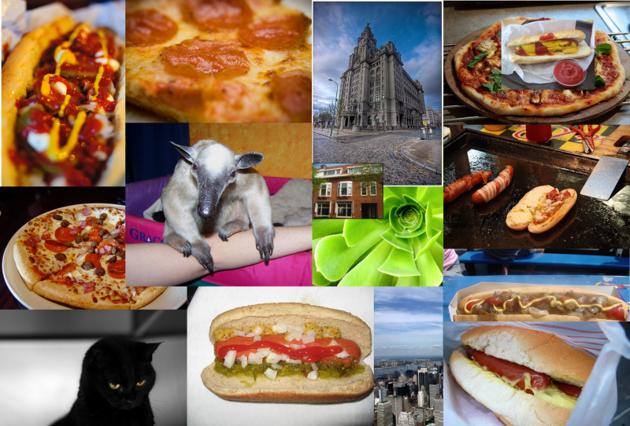
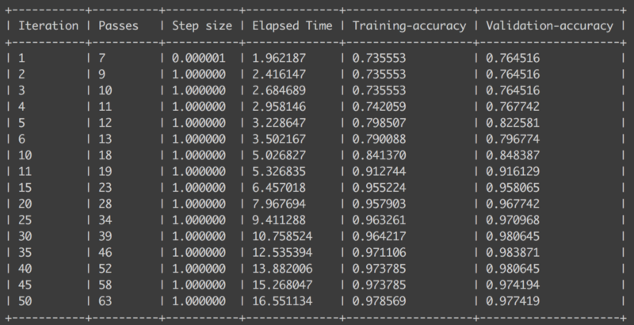

> _“What would you say if I told you there is a Sketch plugin on the market that tells you if a layer in your document is a hotdog or not a hotdog. It is very good and I do not want to work on it anymore. You can hire someone else.”_

`youtube: ACmydtFDTGs`

The Not Hotdog app from HBO’s Silicon Valley has become one of the most iconic jokes in tech. There have been many real life implementations on a lot of different platforms, but one has been missing, until now that is. I set out to build the Sketch plugin that’s been absent from every designer’s day-to-day workflow and here’s how I made it a reality.


As it turns out, creating a Sketch plugin that can tell if a Layer is a hotdog or not isn’t even that difficult, thanks to the hard work of Apple’s engineers. A Sketch plugin can use both JavaScript libraries (so you can do some crazy stuff by leveraging other people’s work, like [sketch-primitives](https://github.com/mathieudutour/sketch-primitive) or [rough-sketch](https://github.com/mathieudutour/rough-sketch)) and macOS APIs. This means that we get the best of both worlds and, most importantly, allows us to take advantage of Apple’s new [Core ML framework](https://developer.apple.com/machine-learning/).

This new macOS framework makes machine learning accessible to developers in a way that’s never been possible before. The Not Hotdog plugin was actually my first excursion into the world of machine learning and it was simpler to get to grips with than I imagined — in fact the entire plugin fits in just 100 lines of code, half of which are empty (because white space is important kids).

Want to build your own machine learning Sketch plugin? All you need is your laptop and a whole lot of pictures of hotdogs. Let’s get started.

To create a plugin that says if a layer contains a hotdog or not, we need to:

- train a classifier
- create a Sketch plugin which uses that classifier

If you’re following along, all the code is open source and available here: [https://github.com/mathieudutour/sketch-hotdog](https://github.com/mathieudutour/sketch-hotdog).

### Training the classifier

A classifier is a system that can tell which dataset an item is most likely to belong to, based on examples of other items that belong to those sets. The examples are called a“training set” and feeding the classifier that information is called “training”.

In our case, we want to train a classifier to recognize if an image contains a hotdog or not.

#### Collecting the training set

The first thing we need to do is to gather images for our training set. The best way to do this is to [be a professor at Stanford and give each of your students an assignment to collect pictures of food for you](https://www.youtube.com/watch?v=T0FA_69nXjM). I don’t know about you but I am not a professor at Stanford, so we will need to collect our images the old fashioned way.

[ImageNet](http://www.image-net.org/) is a database of images that can be searched by keyword. It also allows you to choose a keyword and download a list of URLs of images related to that keyword, which is pretty useful for what we’re about to do. I chose the keywords “hotdog”, “chilidog” and “frankfurter” for images of hotdogs, and “pets”, “buildings”, “plants”and “pizza” for images of not hotdogs. If you don’t want to source your own image URLs, you [can just grab mine](https://github.com/mathieudutour/sketch-hotdog/tree/master/dataset-urls).

Next, we need to loop through the URLs and download the actual images. We can use a script to do this automatically — I won’t explain it in detail here but you can [find the script on Github](https://github.com/mathieudutour/sketch-hotdog/blob/master/scripts/download-images.js) — just follow the instructions on the top of the file. This script will download the images and store them in two folders: `hotdog` and `not_hotdog`.



#### Building the model

Now that we have our training set, we need to train the classifier (or build the model). Training a classifier is usually a very complicated task with a lot of parameters. Luckily for us, Apple have created an open source tool called [Turi Create](https://github.com/apple/turicreate) which makes this process a whole lot easier, so we’re just going to use that.

First, you need to [install Turi Create](https://github.com/apple/turicreate#installation). Don’t worry, I’ll wait here.

Once you’re done with the installation, we need to create a Python script to build our model. Turi Create has a convenient method to load all the images in a folder, recursively.

```python
import turicreate as tc
import os

data = tc.image_analysis.load_images(
  './datasets/',
  with_path=True
)
```

You might see a bunch of “Not a JPEG file” errors because some of the images we downloaded were corrupted but you can safely ignore these. The argument `with_path=True` adds a `path` column to the resulting data frame with the absolute path of each image.

Thanks to that field, we can label the images — if the path contains `/hotdog/` then it’s a hotdog— simple, right?

```python
data['label'] = data['path'].apply(
  lambda path: 'hotdog' if '/hotdog/' in path else 'nothotdog'
)
```

At this point, you can ask Turi Create to show a UI to explore the dataset we just labeled.

```python
data.explore()
```

Now it’s time to train our classifier using our training set. Thanks to Turi Create, we only need one method to do so.

```python
model = tc.image_classifier.create(
  data, # use the training set
  target='label', # classify based on the label
  model='squeezenet_v1.1',
  max_iterations=50
)
```

It will automatically take 5% of our data as a“validation set” and check how well the classifier is doing (guessing first and then checking the label to see if it is correct). You can tweak the number of iterations to see how it affects the accuracy. If you use too high a number, you will notice the accuracy starts to decrease. This is because of a phenomenon called “[overfitting](https://en.wikipedia.org/wiki/Overfitting)” which causes the model to be so good for the training data that it becomes too specific.



We’re nearly there now — the last thing we need to do is save the model so that our Sketch plugin can use it. Use the following command to do so.

```python
model.export_coreml('HotdogNotHotdog.mlmodel')
```

[Here’s a link to the entire script.](https://github.com/mathieudutour/sketch-hotdog/blob/master/scripts/turi-model.py.)

### Creating the Sketch plugin

Now that we have our classifier, we need to create a Sketch plugin that will use it to classify our image layers. To create the plugin, we are going to use an open source tool called [skpm](https://github.com/skpm/skpm). It automates a lot of the tasks involved in developing and publishing plugins, letting you focus on the actual code. To get started you’ll need to [install skpm](https://github.com/skpm/skpm#installation).

#### Setting up the plugin

Now we can create our plugin. In Terminal, run the following command:

```bash
skpm create sketch-hotdog && cd sketch-hotdog
```

This will create a folder called `sketch-hotdog`, install some dependencies that are needed to build a plugin, and bootstrap a few files to make a simple, boilerplate plugin. It should appear in the Plugins menu in Sketch. Go ahead and try to run it! Impressive, right?

Before diving into the code, we need to do a few things. First we need to open Sketch, create a new document, insert an image and select the image. Then we need to put our classifier model somewhere our plugin can access it. You will notice an `assets` folder in the `sketch-hotdog` directory. Every file inside this folder can be accessed by the plugin so let’s move our model there. We need to rebuild the plugin every time we make changes to the code so we need to do that next. You can do so by running the following command in your terminal: `npm run watch`.

Alright, we are all set. You need to open the following file `sketch-hotdog/src/my-command.js` in your favorite code editor. All the code that we are going to write will go inside the function already defined.

#### Interacting with the Sketch document

First we need to grab hold of the layer in the user’s selection and check if it is an image layer. If you are familiar with JavaScript and NodeJS, it will look familiar to you. The API to interact with Sketch is available as woulda core package be available in NodeJS.

```js
var sketch = require("sketch")
```

If you’re not totally familiar with the Sketch API you can [check out the documentation](https://developer.sketchapp.com/reference/api).

Let’s start by getting the first layer of the Sketch selection.

```js
const document = sketch.getSelectedDocument()
const selectedLayer = document.selectedLayers.layers[0]
```

We then need to check if we actually have a layer and if the layer is an [image](https://developer.sketchapp.com/reference/api/#image). If we don’t, we are gonna show a message to tell the user to select one.

```js
if (!selectedLayer || selectedLayer.type !== "Image") {
  sketch.UI.message("You need to select an image")
  return
}
```

#### Leveraging macOS frameworks

A Sketch plugin runs in Sketch which is a native macOS application. This means that it has access to all the macOS frameworks. By default, only two are made available: [Foundation](https://developer.apple.com/documentation/foundation?changes=_5&language=objc) and [AppKit](https://developer.apple.com/documentation/appkit?language=objc). You can already go a long way using those two frameworks. But the one we need for our machine learning plugin is called [Vision](https://developer.apple.com/documentation/vision?language=objc). Not to worry, we can load it in our plugin.

```js
framework("Vision")
```

Now that we have access to the Vision framework, we need to load our classifier model that we previously put in the `assets` folder.

The method that we need is [[`MLModel compileModelAtURL:error:`]](https://developer.apple.com/documentation/coreml/mlmodel/2921516-compilemodelaturl?language=objc). Yes I know, it’s not JavaScript, it’s Objective-C. We can’t use it directly so we need to change the syntax a bit. Don’t worry though, this is fairly easy:

- First remove the square brackets
- Then replace the space between the class and the method with a `.`
- Replace the `:` with a `_` (you can omit the last one)
- And then call the method as you would call any JavaScript function

So `[MLModel compileModelAtURL:error:]` becomes `MLModel.compileModelAtURL_error()`.

Now let’s get our model.

```js
// compile the model
const compiledModelURL = MLModel.compileModelAtURL_error(
  context.plugin.urlForResourceNamed("HotdogNotHotdog.mlmodel"),
  null
)
// load the compiled model
const model = MLModel.modelWithContentsOfURL_error(compiledModelURL, null)
// transform our model into a Vision model
const vnModel = VNCoreMLModel.modelForMLModel_error(model, null)
// create a an image analysis request that uses
// our Core ML model to process images
const request = VNCoreMLRequest.alloc().initWithModel(vnModel)
```

We now need to create a “request handler” which will take the image analysis request we just created and apply it to our image layer.

```js
// VNImageRequestHandler expects a "CIImage"
// Luckily, we can create one from our image layer
const ciImage = CIImage.imageWithData(selectedLayer.image.nsdata)
const handler = VNImageRequestHandler.alloc().initWithCIImage_options(
  ciImage,
  null
)
```

We are nearly there — let’s run our classifier!

```js
const success = handler.performRequests_error([request], null)
```

The last step is toget the result from the classifier and show a message to the user.

```js
if (success) {
  const bestEstimation = request.results()[0]
  const isAHotDog = String(bestEstimation.identifier()) === "hotdog"
  sketch.UI.message(isAHotDog ? "Yep, it's a 🌭" : "Nope ❌")
} else {
  sketch.UI.message("Something went wrong 😕")
}
```

Done! Now you can check if a layer is a hotdog or not a hotdog. I’m sure you’re wondering how you managed to work before you were able to do this!

The code for the plugin command is available here: [https://github.com/mathieudutour/sketch-hotdog/blob/master/src/is-it-a-hotdog.js](https://github.com/mathieudutour/sketch-hotdog/blob/master/src/is-it-a-hotdog.js).

### Conclusion

While this is a fairly silly example, I’ve just shown how you can implement and utilise machine learning in a Sketch Plugin. Let me rephrase that — we introduced artificial intelligence into design tools, and not just any AI. By taking advantage of Apple’s Core ML framework we get maximum performance and efficiency while running state of the art machine learning models, on the device — so data doesn’t even need to leave your MacBook to be analyzed.

AI is becoming a part of design tools and it’s happening faster than anyone imagined. From [mutating design](https://medium.com/project-phoebe/meet-project-phoebe-a-moonshot-concept-for-mutative-design-88d997f7ff14) to [generating code based on low fidelity wireframes](https://airbnb.design/sketching-interfaces/) to [suggesting which components you might want to place next on your artboard](https://twitter.com/thatbenlifetho/status/992193809961308162), the potential for machine learning in design is almost limitless. I can’t wait to see what the future holds — here’s hoping it’s more than just hotdogs.
