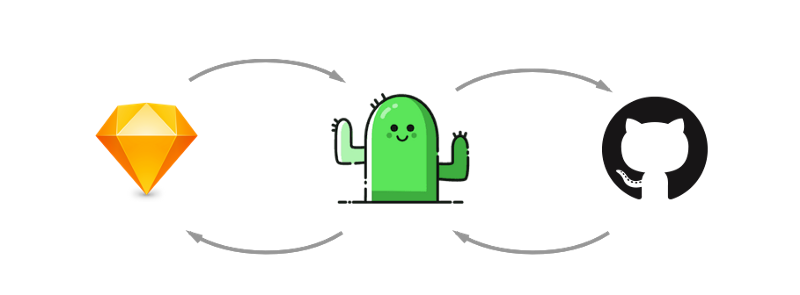

If you haven’t read my previous post about [version control for designers](https://blog.enki.com/yes-designers-can-use-git-too-79f3cef9c899), here is a quick Tl;DR;:

- [Version control](https://git-scm.com/book/en/v2/Getting-Started-About-Version-Control) is a system which records and stores every change made to a set of files so that you can go back to a previous state at any time. Developers use it extensively, designers don’t.
- And no, Dropbox is not a version control system: you can’t control when a new version should be added or describe what it is about. It is merely a synchronization tool.

Even though I affirmed that “designers can use git”, that wasn’t entirely true. A big piece of the puzzle was missing: allowing the machine to understand how two different sets of changes interact with each other in order to keep both of them.

Until now, if two designers were working on the same file in parallel, there was no way to automatically merge the changes. Someone would need to open both versions and manually choose what was relevant. It was really cumbersome and a big factor in why designers were reluctant to use version control.

In my previous post, I called to [tweet the Sketch team](https://twitter.com/search?q=please%20make%20the%20sketch%20files%20mergable&src=typd) to make the sketch files mergeable and they listened (Thank you BC!). Starting with Sketch 43, the file format can be manipulated easily by third parties. That’s a big deal and we are only starting to understand what it will allow us to do.

### Meet Kactus

[Kactus](http://kactus.io) takes advantage of this new file format and brings you true version control for your design.

It looks at your sketch files and transforms them into a format that [git](https://git-scm.com) can understand. By doing so, we can close the gap between designers and developers by using a common platform: [Github](https://github.com). All the workflows available to developers are now available to designers as well:

- work in parallel on the same file in different [branches](https://www.git-tower.com/blog/understanding-branches-in-git/)
- create [Pull Requests](https://help.github.com/articles/about-pull-requests/) to tell others about changes

Kactus will take care of updating your sketch files when the underlying files change so you don’t have to worry about it.

But it goes beyond that. Have you ever wanted to share some symbols across multiple files? Have you ever wanted to share your text styles across your entire project? And keep them in sync when you change one? Hang tight.

### One more thing…

Because Kactus understands your files, you can tell him that you want to share a page of your sketch file across all your sketch file. Or your text styles. Or your shape styles. Or your document colors.

And every time Kactus will re-generate your sketch files, it will include the said page. It will even keep the symbol overrides in place!

### And beyond!

Next logical step? Putting those shared pages on the Internet, in a registry. You will be able to setup your project with open source version controlled components from total strangers!

Imagine being able to use an iPhone wireframe without needing to copy and paste it every time. Or publishing a UI kit and to know how many people are using it. And being able to fix it and see that fix propagated to all the designs!

That’s what open source is all about and that’s what Kactus is unlocking. (Oh and by the way, Kactus itself is open source: [https://github.com/kactus-io/kactus](https://github.com/kactus-io/kactus))
